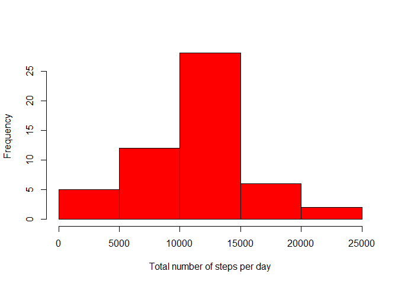
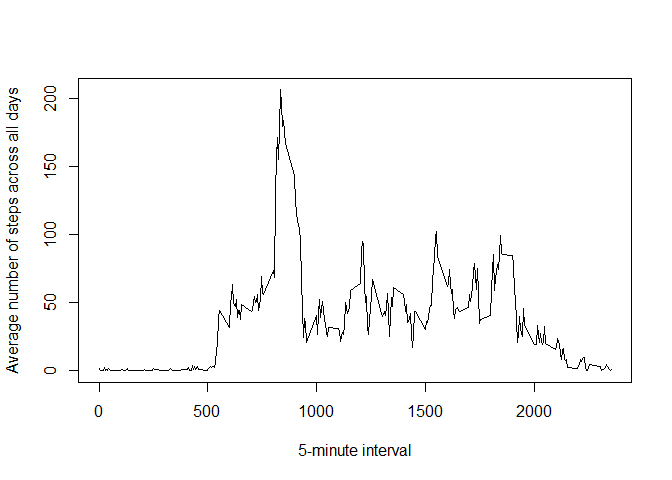
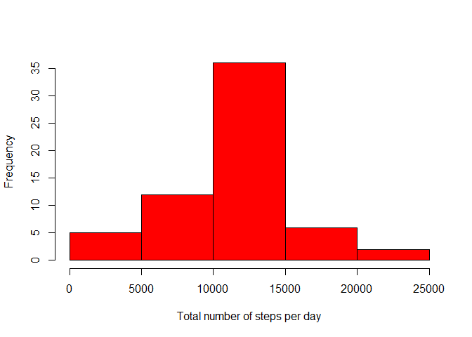
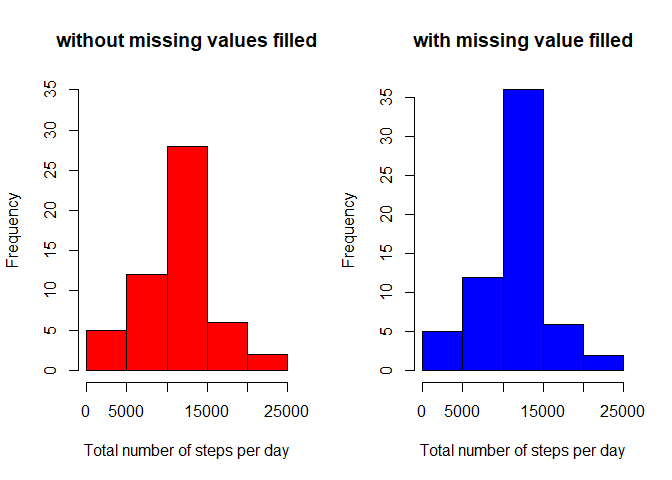
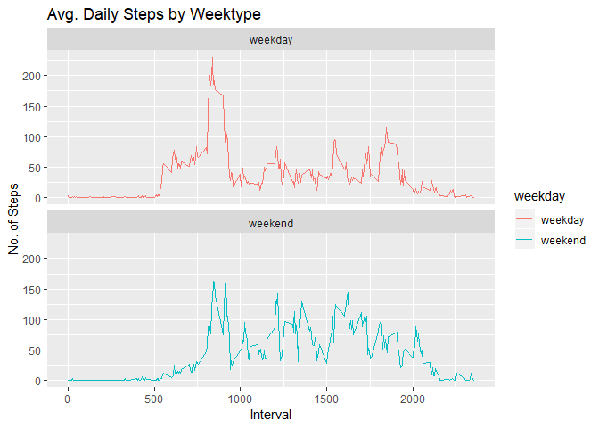

## Introduction

It is now possible to collect a large amount of data about personal movement using activity monitoring devices such as a Fitbit, Nike Fuelband, or Jawbone Up. These type of devices are part of the “quantified self” movement – a group of enthusiasts who take measurements about themselves regularly to improve their health, to find patterns in their behavior, or because they are tech geeks. But these data remain under-utilized both because the raw data are hard to obtain and there is a lack of statistical methods and software for processing and interpreting the data.

This assignment makes use of data from a personal activity monitoring device. This device collects data at 5 minute intervals through out the day. The data consists of two months of data from an anonymous individual collected during the months of October and November, 2012 and include the number of steps taken in 5 minute intervals each day.

The data for this assignment can be downloaded from the course web site:

[Dataset: Activity monitoring data [52K]](https://d396qusza40orc.cloudfront.net/repdata%2Fdata%2Factivity.zip)

The variables included in this dataset are:

- steps: Number of steps taking in a 5-minute interval (missing values are coded as NA\color{red}{\verb|NA|}NA)
- date: The date on which the measurement was taken in YYYY-MM-DD format
- interval: Identifier for the 5-minute interval in which measurement was taken

The dataset is stored in a comma-separated-value (CSV) file and there are a total of 17,568 observations in this dataset.


## Objective of the data analysis

The main purpose of this analysis is to answer to the following question: Are there differences in activity patterns between weekdays and weekends?


## Approach

Our approach consists in:

1. Analyzing the total number of steps taken each day
2. Analyzing the 5-minute intervals and the average number of steps taken, averaged across all days
3. Impute missing values and evaluate the impact on data
4. Using the data with imputed missing values, evaluate whether there are any differences in activity patterns between weekdays and weekends


## 1. Analysis of the total number of steps taken each day

    + Histogram of the total number of steps taken each day


```r
## Loading and preprocessing the data
dfActivity <- read.csv("activity.csv", header = TRUE, sep= ",")

dfActivityPerDay <- aggregate(steps ~ date, dfActivity, sum)
hist(dfActivityPerDay$steps, main="", xlab="Total number of steps per day", ylab="Frequency", col="Red")        
```

<!-- -->

    + Mean and median of the total number of steps taken per day


```r
summary(dfActivityPerDay$steps)
```

```
##    Min. 1st Qu.  Median    Mean 3rd Qu.    Max. 
##      41    8841   10765   10766   13294   21194
```

## 2. Analysis of the 5-minute intervals and the average number of steps taken, averaged across all days

    + Time series plot of the 5-minute interval (x-axis) and the average number of steps taken, averaged across all days (y-axis)


```r
dfAverageActivityPerInterval <- aggregate(steps ~ interval, dfActivity, mean)
with(dfAverageActivityPerInterval,plot(x=interval, y=steps, type="l", xlab="5-minute interval", ylab="Average number of steps across all days"))
```

<!-- -->


    + 5-minute interval containing the maximum number of steps on average across all the days in the dataset


```r
dfAverageActivityPerInterval$interval[which.max(dfAverageActivityPerInterval$steps)]
```

```
## [1] 835
```


# 3. Impute missing values and evaluate the impact on data

    + In order to fill in all of the missing values in the dataset, we use the mean for the corresponding 5-minute interval


```r
## Calculate and report the total number of missing values in the dataset (i.e. the total number of rows with NA)
table(is.na(dfActivity$steps))
```

```
## 
## FALSE  TRUE 
## 15264  2304
```

```r
## We use the mean for the corresponding 5-minute interval
## Create a new dataset that is equal to the original dataset but with the missing data filled in.
dfActivityWithFilledSteps <- dfActivity 
dfActivityStepsNotFilled <- dfActivity[is.na(dfActivity$steps),]

for (i in rownames(dfActivityStepsNotFilled)){
        ## dfAverageActivityPerInterval[dfAverageActivityPerInterval$interval == dfActivityStepsNotFilled[i,]$interval,]$steps
        dfActivityWithFilledSteps[i,]$steps <- dfAverageActivityPerInterval[dfAverageActivityPerInterval$interval == dfActivityStepsNotFilled[i,]$interval,]$steps
}
```

    + Histogram of the total number of steps taken each day (with missing value filled for steps)


```r
dfActivityPerDayWithFilledSteps <- aggregate(steps ~ date, dfActivityWithFilledSteps, sum)
hist(dfActivityPerDayWithFilledSteps$steps, main="", xlab="Total number of steps per day", ylab="Frequency", col="Red")        
```

<!-- -->


    + Mean and median total number of steps taken per day. 

```r
summary(dfActivityPerDayWithFilledSteps$steps)
```

```
##    Min. 1st Qu.  Median    Mean 3rd Qu.    Max. 
##      41    9819   10766   10766   12811   21194
```

**These values differ from the estimates from the first part of the assignment.** Here is a comparison between the 2 histograms: 

```r
par(mfrow=c(1,2))
Hist1 <- hist(dfActivityPerDay$steps, main="without missing values filled", xlab="Total number of steps per day", ylab="Frequency", col="Red", ylim=c(0, 35))        
Hist2 <- hist(dfActivityPerDayWithFilledSteps$steps, main="with missing value filled", xlab="Total number of steps per day", ylab="Frequency", col="Blue")        
```

<!-- -->

The impact of imputing missing data on the estimates of the total daily number of steps is an increase of the maximum value of the frequency of the interval corresponding to the 15000 steps by :

```r
Max1 <- Hist1$counts[which.max(Hist1$counts)]
Max2 <- Hist2$counts[which.max(Hist2$counts)]
Impact <- (Max2 - Max1)/Max1*100
paste(round(Impact, 2), "%", sep="")
```

```
## [1] "28.57%"
```


**The data with imputed missing values seem to be more reliable. Thus, we will use these data for the pattern analysis.**


# 4. Using the data with imputed missing values, evaluating whether there are any differences in activity patterns between weekdays and weekends

    + Panel plot containing a time series plot of the 5-minute interval (x-axis) and the average number of steps taken, averaged across all weekday days or weekend days (y-axis).


```r
## Use the dataset with the filled-in missing values for this part.
## Create a new factor variable in the dataset with two levels – “weekday” and “weekend” indicating 
dfActivityWithFilledSteps$weekday <- as.factor(ifelse(weekdays(as.Date(dfActivityWithFilledSteps$date)) %in% c("samedi", "dimanche"), "weekend", "weekday"))

## whether a given date is a weekday or weekend day
## Make a panel plot containing a time series plot of the 5-minute interval (x-axis) 
## and the average number of steps taken, averaged across all weekday days or weekend days (y-axis).
dfAverageActivityPerTypeOfDay <- aggregate(steps ~ weekday+interval, dfActivityWithFilledSteps, mean)
library(ggplot2)
```

```
## Registered S3 methods overwritten by 'ggplot2':
##   method         from 
##   [.quosures     rlang
##   c.quosures     rlang
##   print.quosures rlang
```

```r
ggplot(dfAverageActivityPerTypeOfDay , aes(x = interval , y = steps, color=weekday)) + geom_line() + labs(title = "Avg. Daily Steps by Weektype", x = "Interval", y = "No. of Steps") + facet_wrap(~ weekday , ncol = 1, nrow=2)
```

<!-- -->

The plots show that **there are differences in activity patterns between weekdays and weekends**. As a matter of a fact, **during the weekdays, there is a peak of activity between 8am and 10am** which could be due to the fact that people go to their office or shools. **During the weekends, the activity is lower between 8am and 10 am but is higher for the rest of the day**. This can be explained by the fact that during weekends, people have their recreational activities (sports, shopping, museum, ...) and therefore, after 10am, walk more than during the weekdays. 
